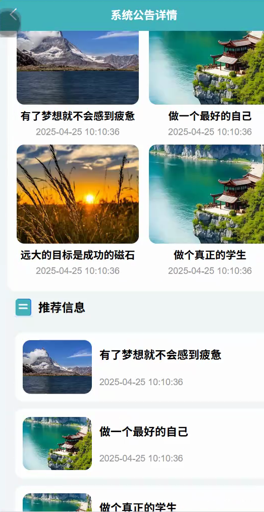
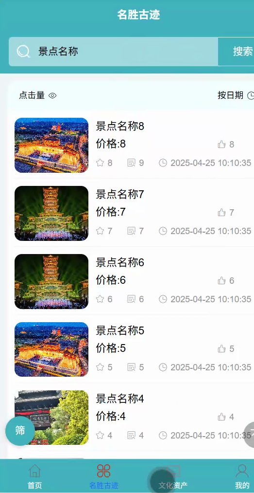
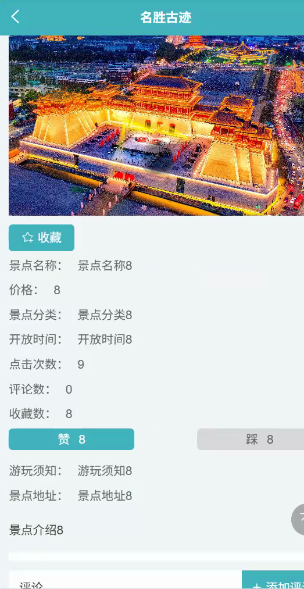
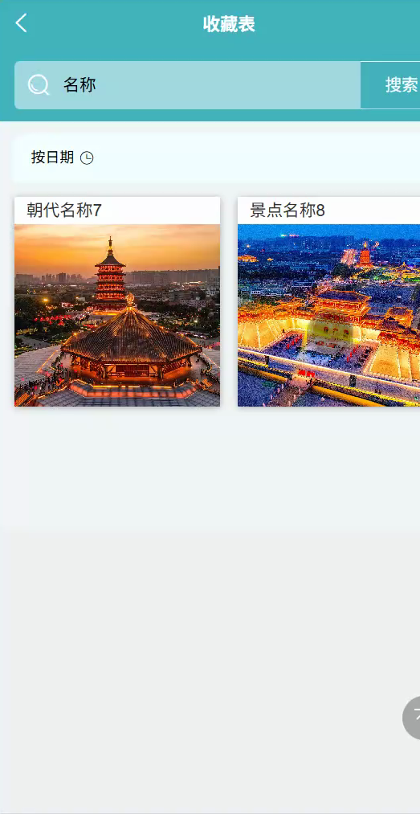
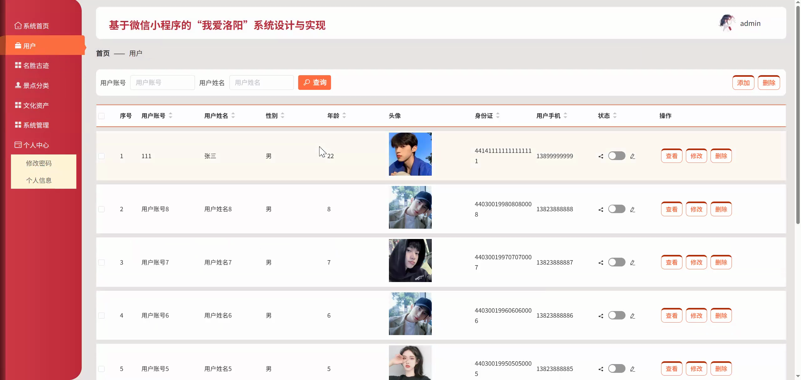
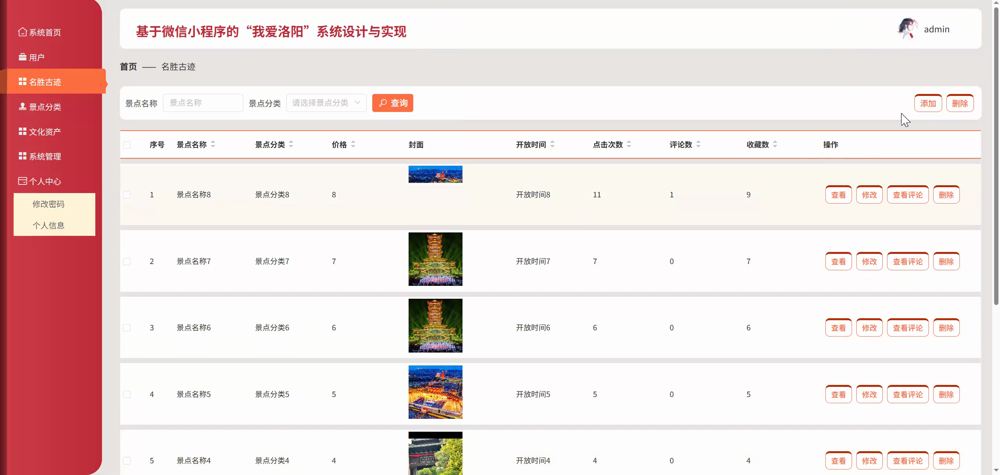
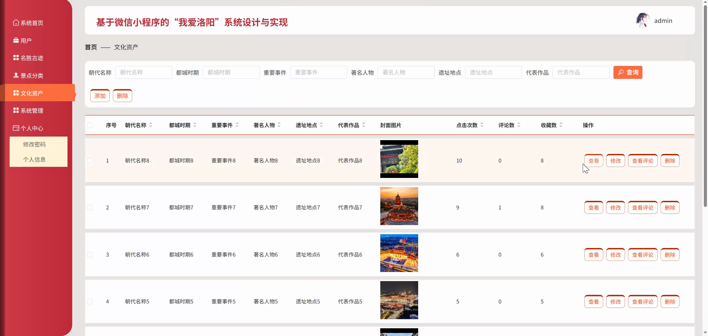
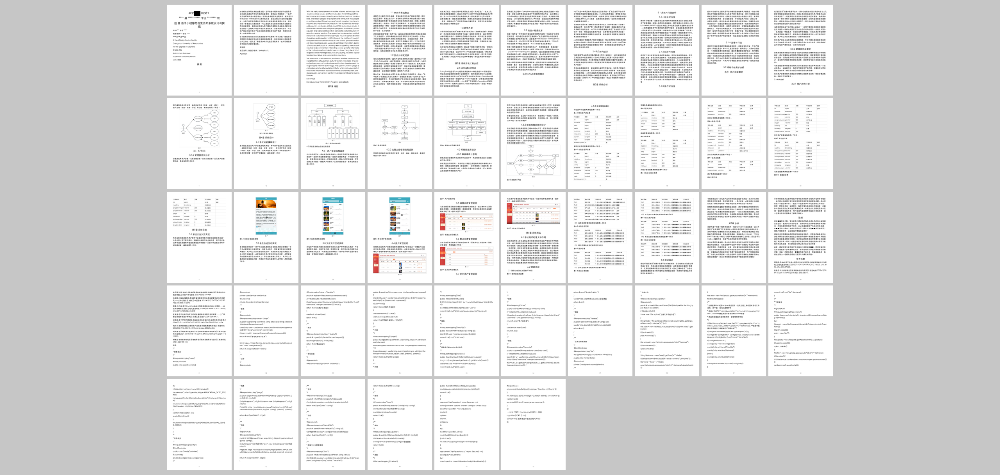

## 源码问题查看主页咨询

### 一、关键词
洛阳文旅小程序、名胜古迹展示、文化资产浏览、旅游资讯管理、微信小程序系统

### 二、作品包含
源码+数据库+万字设计文档+全套环境和工具资源+本地部署教程

### 三、项目技术
前端技术： Html、Css、Js、Vue2.6、Element-ui、uniapp
后端技术：Java、SpringBoot2.2.2、MyBatis-Plus

### 四、运行环境（以下版本亲测，其他版本兼容性请自行测试）
开发工具：IDEA/eclipse + VSCODE + HBuilder X + 微信开发者工具

数据库：MySQL5.7+

数据库管理工具：Navicat10以上版本

环境配置软件： JDK1.8 + Maven3.6.3

前端Nodejs：14+

浏览器：谷歌浏览器

### 五、项目介绍
项目编号：mpweixinA250D

基于微信小程序的“我爱洛阳”系统围绕洛阳城市文旅宣传与信息服务展开，提供名胜古迹、文化资产、旅游资讯、收藏评论和后台维护等功能，方便用户通过小程序了解洛阳特色资源，也便于管理员统一管理文旅内容和基础数据。

角色：管理员、用户

用户功能：注册登录、名胜古迹浏览、文化资产查看、资讯阅读、收藏评论、个人信息维护。

管理员功能：登录、用户管理、景点分类管理、名胜古迹管理、文化资产管理、资讯管理、轮播图配置。

### 六、运行截图

